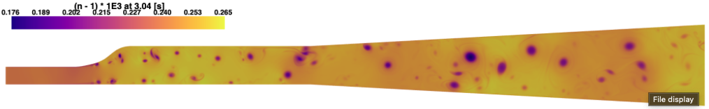
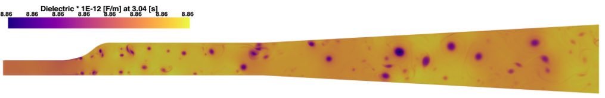

CFD
===

Let’s explore a more complex example by using the results from a Computational Fluid Dynamics (CFD) simulation to calculate some optical properties. We will not delve into the details of setting up a CFD simulation; instead, the following example will use results generated with OpenFOAM.

For this example, an additional module, ``pyvista``, is required to parse the CFD results data. Please follow the instructions in the next section to install ``pyvista``. If you already have ``pyvista`` installed, you can skip the next code lines.

.. code:: console

    $ pip install pyvista

Next, lets load the `*.foam` file. For additional details, please refer to the `OpenFOAM documentation <https://www.openfoam.com>`_ and the `PyVista documentation <https://pyvista.org/>`_. The following lines of code will load the foam data using ``pyvista``. 

.. code:: python

    import pyvista as pv

    reader = pv.POpenFOAMReader('results.foam')
    internal_mesh = mesh['internalMesh']

Lets now use the ``HAOT`` package to process the results

.. code:: python

    import haot

    index_of_refraction = haot.index_of_refraction_density_temperature(
                                            internal_mesh['T'],
                                            internal_mesh['rho'], 'Air', 633)

    kerl_polarizability = haot.kerl_polarizability_temperature(
                                            internal_mesh['T'],
                                            'Air', 633)

    dielectric_constant_dilute = haot.dielectric_material_const(index_of_refraction['dilute'])

Now, let's plot the dilute index of refraction using ``pyvista``.

.. code:: python

    internal_mesh.cell_data['n'] = (index_of_refraction['dilute'] - 1) * 1E3

    plotter = pv.Plotter(window_size=[1800, 900])
    plotter.view_xy()
    plotter.add_mesh(internal_mesh, scalars='n', cmap='plasma',
                     reset_camera='True', show_scalar_bar=False)
    plotter.set_background('white')
    plotter.camera.zoom(2.0)

    plotter.add_scalar_bar(
        title=f'(n - 1) * 1E3 at {time_data[i]} [s]',
        title_font_size=22,
        label_font_size=18,
        bold=True,
        position_x=0.02,
        position_y=0.6,
        width=0.3,
        n_labels=8,
        height=0.1,
        vertical=False
    )

Now, let's plot the Kerl Polarizability using ``pyvista``.

.. code:: python

    internal_mesh.cell_data['pol'] = kerl_polarizability * 1E30

    plotter = pv.Plotter(window_size=[1800, 900])
    plotter.view_xy()
    plotter.add_mesh(internal_mesh, scalars='pol', cmap='plasma',
                     reset_camera='True', show_scalar_bar=False)
    plotter.set_background('white')
    plotter.camera.zoom(2.0)

    plotter.add_scalar_bar(
        title=f'Polarizability * 1E-30 [kg/m3] at {time_data[i]}',
        title_font_size=22,
        label_font_size=18,
        bold=True,
        position_x=0.02,
        position_y=0.6,
        width=0.3,
        n_labels=8,
        height=0.1,
        vertical=False
    )

.. image:: images/kerl_polarizability.png

Now, let's plot the Dielectric's medium constant using ``pyvista``.

.. code:: python

    internal_mesh.cell_data['dielectric_dilute'] = dielectric_constant_dilute * 1E12

    plotter = pv.Plotter(window_size=[1800, 900])
    plotter.view_xy()
    plotter.add_mesh(internal_mesh, scalars='dielectric_dilute', cmap='plasma',
                     reset_camera='True', show_scalar_bar=False)
    plotter.set_background('white')
    plotter.camera.zoom(2.0)

    plotter.add_scalar_bar(
        title=f'Dielectric * 1E-12 [F/m] at {time_data[i]} [s]',
        title_font_size=22,
        label_font_size=18,
        bold=True,
        position_x=0.02,
        position_y=0.6,
        width=0.3,
        n_labels=8,
        height=0.1,
        vertical=False
    )

