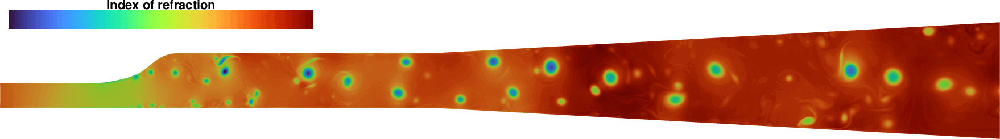
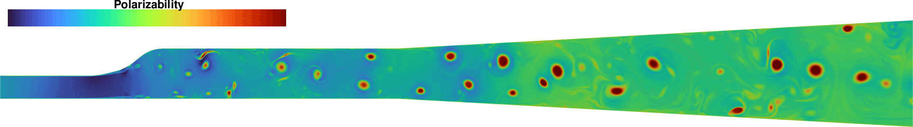
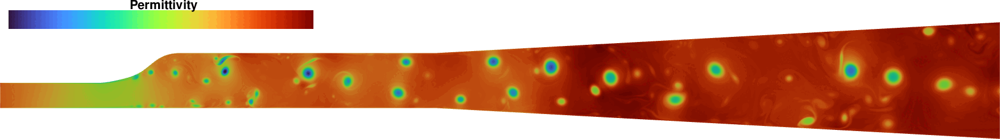

Contour Plots
=============
Now, let's plot the dilute index of refraction using ``pyvista``.

.. code:: python

    # Add the index of refraction to the mesh
    internal_mesh.cell_data['n'] = index_of_refraction['dilute']

    plotter = pv.Plotter(window_size=[1800, 900])
    plotter.view_xy()
    plotter.add_mesh(internal_mesh, scalars='n', cmap='turbo',
                     reset_camera='True', show_scalar_bar=False)
    plotter.set_background('white')
    plotter.camera.zoom(2.0)

    plotter.add_scalar_bar(
        title='Dilute Index of refraction',
        title_font_size=22,
        label_font_size=18,
        bold=True,
        position_x=0.02,
        position_y=0.6,
        width=0.3,
        n_labels=8,
        height=0.1,
        vertical=False,
        fmt=""
    )

    plotter.show()

Now, let's plot the Kerl polarizability using ``pyvista``.

.. code:: python

    # Add polarizability to the mesh
    internal_mesh.cell_data['pol'] = kerl_polarizability

    plotter = pv.Plotter(window_size=[1800, 900])
    plotter.view_xy()
    plotter.add_mesh(internal_mesh, scalars='pol', cmap='turbo',
                     reset_camera='True', show_scalar_bar=False)
    plotter.set_background('white')
    plotter.camera.zoom(2.0)

    plotter.add_scalar_bar(
        title='Polarizability',
        title_font_size=22,
        label_font_size=18,
        bold=True,
        position_x=0.02,
        position_y=0.6,
        width=0.3,
        n_labels=8,
        height=0.1,
        vertical=False,
        fmt=""
    )

    plotter.show()

Now, let's plot the permittivity of the medium using ``pyvista``.

.. code:: python

    # Add Permittivity constant to the mesh
    internal_mesh.cell_data['permittivity_dilute'] = permittivity_dilute

    plotter = pv.Plotter(window_size=[1800, 900])
    plotter.view_xy()
    plotter.add_mesh(internal_mesh, scalars='permittivity_dilute', cmap='turbo',
                     reset_camera='True', show_scalar_bar=False)
    plotter.set_background('white')
    plotter.camera.zoom(2.0)

    plotter.add_scalar_bar(
        title='Permittivity',
        title_font_size=22,
        label_font_size=18,
        bold=True,
        position_x=0.02,
        position_y=0.6,
        width=0.3,
        n_labels=8,
        height=0.1,
        vertical=False,
        fmt=""
    )

    plotter.show()

Now, let's plot the electric susceptibility using ``pyvista``.

.. code:: python

    # Add Electric Susceptibility constant to the mesh
    internal_mesh.cell_data['susceptibility_dilute'] = susceptibility_dilute

    plotter = pv.Plotter(window_size=[1800, 900])
    plotter.view_xy()
    plotter.add_mesh(internal_mesh, scalars='susceptibility_dilute', cmap='turbo',
                     reset_camera='True', show_scalar_bar=False)
    plotter.set_background('white')
    plotter.camera.zoom(2.0)

    plotter.add_scalar_bar(
        title='Susceptibility',
        title_font_size=22,
        label_font_size=18,
        bold=True,
        position_x=0.02,
        position_y=0.6,
        width=0.3,
        n_labels=8,
        height=0.1,
        vertical=False,
        fmt=""
    )

    plotter.show()

