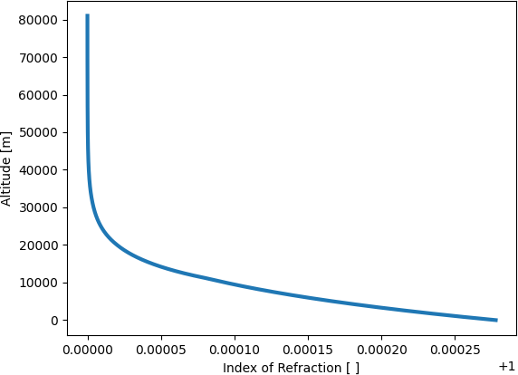

Optics
======

For this example, we will calculate the index of refraction change as a
function of atmospheric altitude. Lets open a Python instance and type the
following:

.. code:: python

    import haot
    import numpy as np
    import matplotlib.pyplot as plt

    # Create an altitude vector from 1 to 81 km with 1000 elements on it
    altitude_m = np.linspace(0, 81e3, 10000)  

    blue_sky = haot.atmospheric_idex_of_refraction(altitude_m)

    # Lets plot the results now:
    plt.plot(blue_sky, altitude_m, linewidth=3)
    plt.xlabel('Index of Refraction [ ]')
    plt.ylabel('Altitude [m]')

The figure below illustrates the variation in the index of refraction as a function of altitude.
For specific equations, refer to the source code. You can access this information by exploring the optics module documentation or using the help function within your interactive Python environment.

The optics module has more functions, please refer to the optics module
documentation.
