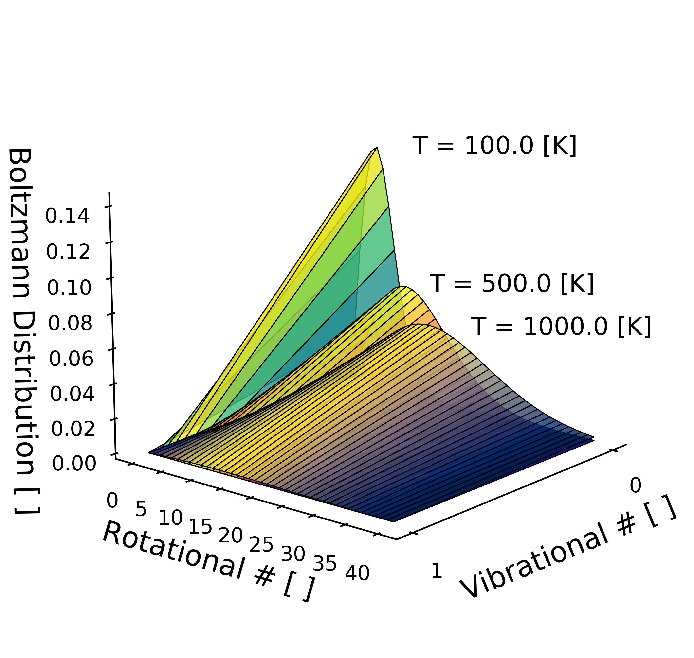

Quantum Mechanics
=================
For this example, we will calculate the Boltzmann Distribution for a diatomic
Nitrogen molecule. Lets open a Python instance and type the following.

.. code:: python
    
    import haot
    import numpy as np

    # Ranges where distribution is calculated 
    vibrational_number = 1
    rotational_number = 30
    temperature_K = [100.0, 500.0, 1000.0]

    # Empty 3D array [temperature, vibrational, rotational]
    distribution = np.zeros([np.size(temperature_K),
                             vibrational_number + 1,
                             rotational_number + 1])

    # Loop through all the temperatures
    for t, val in enumerate(temperature_K):
        distribution[t] = quantum_mechanics.boltzmann_distribution( 
                                                val, 'N2', 
                                                vibrational_number,
                                                rotational_number, False)

Please refer to the source code for more more details of the function. You can
access this information by exploring the :ref:`Quantum Mechanics module<Module quantum mechanics target>` documentation or using the ``hel()`` function within your interactive Python environment.

