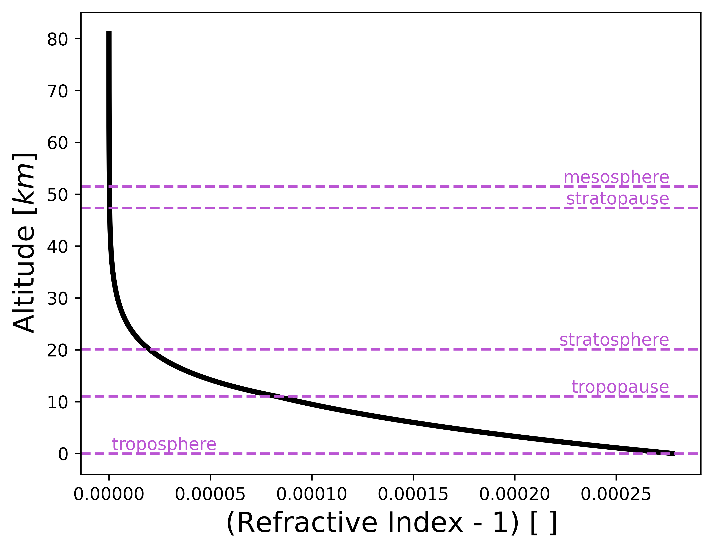
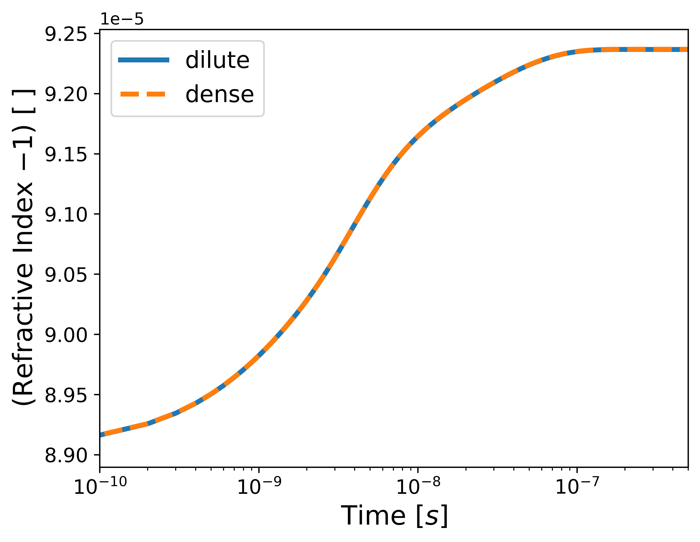

# Summary

Hypersonic flows present a unique challenges due to the complex interplay of fluid dynamics, chemical reactions, and optical phenomena. As a signal from a Light Detection and Ranging (LiDAR) travels through a hypersonic flow field, the beam would be affected by the flow, this can lead to errors on targeting and detection measurements.

`HAOT` is a Hypersonic Aerodynamics Optics Tools Python package developed to calculate the index of refraction of a hypersonic medium. Its source code is available on [GitHub](https://github.com/mliza/HAOT), the documentation is available on [Read the Docs](https://haot.readthedocs.io/en/latest/) and an example on the usage of the package is given on the GitHub repo under the example folder.

# Statement of Need
Many techniques used to calculate optical properties are scattered across various papers, but there is no centralized repository containing all these calculations. Furthermore, some of these calculations require spectroscopy constants, which are often unclear or inconsistently presented in the literature. This package includes a constants module that provides and documents numerous spectroscopy constants for diatomic molecules.

# Algorithms
The `HAOT` package, contains five modules:

    - Aerodynamics
    - Optics
    - Quantum Mechanics
    - Constants
    - Conversions

Each module can be imported independently. The [documentation](https://haot.readthedocs.io/en/latest/) explains he functions in each module as well as their usage. Docstrings were used, so the function prototypes and usage are also available in an interactive Python session.

The equation below was introduced by [@Smith1953], and it is a good approximation
for the change in the index of refraction as a function of altitude. 

$$ n(h) \approx 1 + \frac{K_1}{T(h)} \left( p(h) + K_2\frac{e(h)}{T(h)} \right) \label{eq:atmosphericIndex} $$

Where: $K_1$ and $K_2$ are constants, $T$ is the temperature as a function of altitude, $p$ is pressure as a function of altitude, and $e(h)$ is the partial pressure of water vapor.

Results for this equation are provided in the figure below.

The equation below shows the formula used to calculate the dilute index of refraction.

$$ n -1 = \rho \sum\limits_{s =1}^N K_s \rho_s \label{eq:diluteIndexOfRefraction}$$

Where: $\rho_s$ is the species density, $\rho$ is the flow's density, and $K_s$ is the species' Gladstone-Dale constant.

Results for this equation are provided in the figure below. This particular
results required the use of a Computational Fluid Dynamics (CFD) tool, SU2 [@Maier2021], [@Maier2023a], to calculate the fluid properties used by the `HAOT` tool. 

A more extensive work showing the results of this package was done by [@Liza2023]

# Acknowledgements
The author gratefully thank Kyle Hanquist, who supported with the tool
verification.

# References
