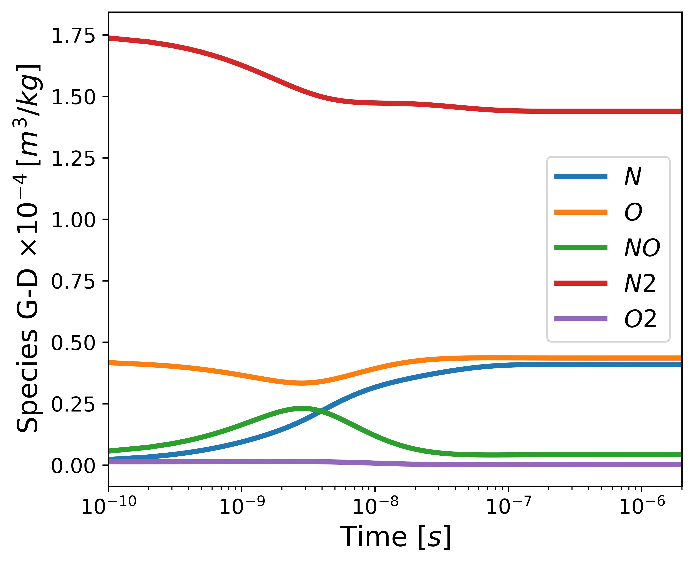

# Summary

Hypersonic flows present a unique challenges due to the complex interplay of
fluid dynamics, chemical reactions, and optical phenomena. As a signal from a
Light Detection and Ranging (LiDAR) travels through a hypersonic flow field,
the beam would be affected by the flow. 

`HAOT` is a Hypersonic Aerodynamics Optics Tools Python package developed to
calculate the index of refraction of a hypersonic medium. 

# Statement of Need
Many techniques used to calculate optical properties are scatter in papers but
there is not a local repo containing all this calculations, furthermore some of
these calculations require the use of spectroscopy constants, which have been
properly documented and added to the package.

# Algorithms
The `HAOT` pacakge, contains five  modules:
- Modules:
    - Arodynamics
    - Optics
    - Quantum Mechanics
    - Constants
    - Conversions

Each module can be imported independed
and the documentation explains in detail what each module does. Furthremore,
docstrings have been added to the function and the description of each function
can be seeing in an interactive python session. \autoref{eq:diluteIndexOfRefraction}
shows the equation used to calculate the index of refraction. Where:  $\rho_s$
is the species density, $\rho$ is the flow's density, and $K_s$ is the specie's
Gladstone-Dale constant.

$$ n -1 = \rho \sum\limits_{s =1}^N K_s \rho_s \label{eq:diluteIndexOfRefraction}$$
$$ n -1 = \rho \sum\limits_{s =1}^N K_s \rho_s \label{eq:denseIndexOfRefraction}$$

and referenced from text using \autoref{figindexOfRefraction}.

A more extensive work showing the results of this pacakge was done by [@Liza2023].

# Acknowledgements

# References
